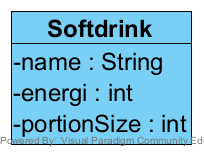
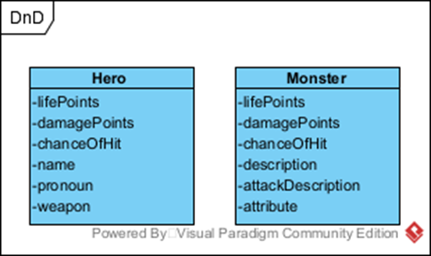

### Opgave 1

Opgavebeskrivelsen findes på slides fra denne lektion

### Opgave 2

Implementer Softdrink klassen med de tre attributter.

Lav en constructor så I kan oprette nogle instanser af klassen. 

Gem jeres instancer i et array. I finder selv værdierne for attributterne.

Lav en metode 

    public static void print(Softdrink[] drinks)

som udskriver listen af softdrinks til konsollen, på en passende måde.

Lav en metode 

    public static int totalEnergi(Softdrink[] drinks) 

der returnerer det totale energi indhold som drinks listen indeholder.

Lav en metode 

    public static double averageSize(Softdrink[] drinks) 

der returnerer den gennemsnitlige størrelse af de drinks som listen indeholder. 

### Opgave 3 - Rektangel 

Følg eksempel med Circle klassen i sektion 9.2 i bogen, design en Rectangle klasse
der repræsentere et rektangel.Denne klasse skal indeholde

- To attributter, width og height af typen double, som repræsentere henholdsvis bredden og højden af rektangelet med standard værdier 1.
- En constructor der opretter et standard rektangel
- En constructor der tager to parameter og opretter et rektangel med disse værdier
- En metode getArea() der returnerer arealet af rektangelen 
- En metode getPerimeter der returnerer omkredsen.

Opret to rektangler i main metoden og afprøv metoderne. 

### Opgave 4

Opret en klasse Stock, der repræsentere en aktie. Denne klasse skal indeholde

- En attribut name af typen String
- En attribut previousClosingPrice af typen double
- En attribut currentPrice af typen double
- En constructor der opretter et Stock objekt med navn.
- En metode getChangeProcent der returnerer den procentvise ændring fra previousClosingPring til currentPrice.

Lav en main metode og opret en instans af Stock klassen, set previousClosingPrice og currentPrice. Test getChangeProcent metoden

### Opgave 5

Implementer metoden printDepartures, så den udskriver en tabel over togafgange
    
    Destination | Peron | Ankomst | Afgang
    København H       1     07:57    08:04
    Aalborg           2     08:03    08:10
    København H       1     08:32    08:40
    Skjern            2     08:46    08:52
    København H       1     08:57    09:04
    Aalborg           2     09:03    09:10
    København H       1     09:32    09:40
    Skjern            2     09:46    09:52

Du får formentlig en fejl, overvej hvorfor du får denne fejl og hvordan du kan rette den.

### Opgave 6

Opret følgende to klasser

Tilføj den kommenterede kode i klassen DnD.

Opret et Hero og et Monster objekt i main metoden. Kald metode fight med de to objekter.

I DnD klassen er der to statiske metoder heroAttacks og monsterAttacks, flyt disse to metoder
til henholdsvis Hero klassen og Monster klassen. 

Fjern static modifierer fra disse metoder og
opdater fight metoden i DnD klassen, så den kalder disse metoder.

